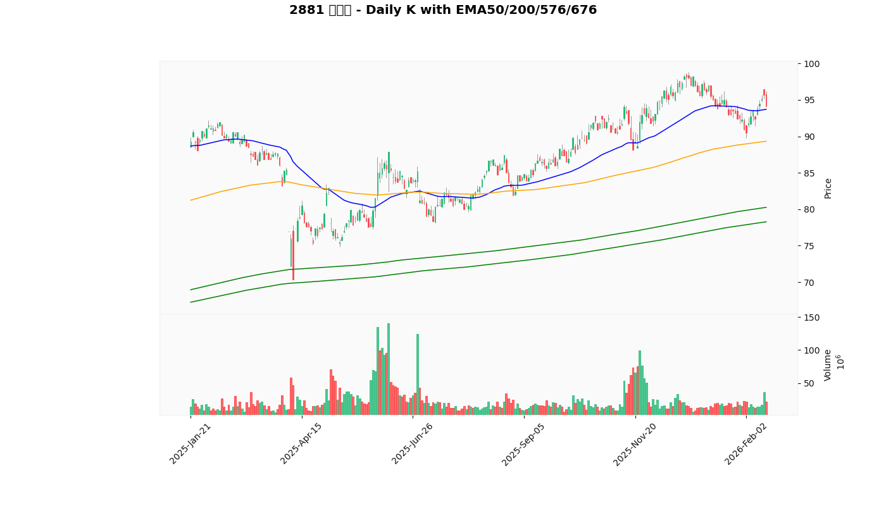
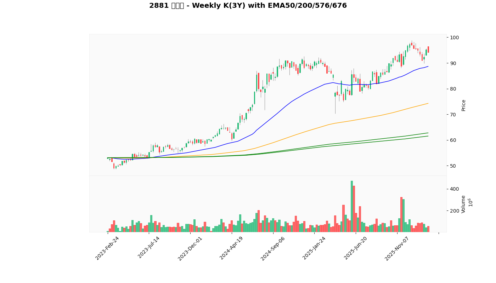

# TW Stock EMA Alert (Telegram)

這個專案會抓取台股日線資料，監控 `config.json` 內指定的股票與 ETF，當商品接近指定 EMA，或命中風險條件時，透過 Telegram 發送圖文通知。

它的定位不是單純報警，而是給交易者一個「市場是否進入恐慌區、是否值得開始評估分批建倉」的輔助觀察工具。

目前通知來源有兩類：

- EMA 接近條件：收盤價接近 `EMA50 / EMA200 / EMA576`（預設 `±1%`）
- 風險條件：4 類條件中至少命中 3 類，用來輔助判斷市場是否出現恐慌賣壓，值得開始觀察建倉

通知會附上：

- 商品代號、日期、收盤價
- 技術位置摘要
  - RSI 狀態：`< 30` 視為低位、`> 55` 視為高位，其餘為正常
  - 距近 3 年歷史高點跌幅：`< 5%` 高位、`5%~15%` 正常、`> 15%` 低位
- 接近哪幾條 EMA
- `EMA50 > EMA200` 是否成立
- 風險條件 4 類的明細
- 近一年日 K 圖
- 近三年周 K 圖

如果你的交易風格偏向逢低布局，這個專案的核心用途是：

- 幫你先把「價格快速下殺、技術面轉弱、量能放大」的標的挑出來
- 在市場恐慌時，快速辨識哪些商品進入可以開始看、開始分批規劃的區域
- 把主觀盯盤，轉成固定規則的提醒

## 實際傳送內容

### 無命中時

```text
本次掃描完成：沒有商品符合 EMA 接近或風險 4 選 3 條件。
```

### 命中時

```text
00631L 元大台灣50正2
日期: 2026-03-12
收盤價: 189.50
技術位置: 🔴 RSI 28.45(低位) / ⚪ 距高點下跌 8.20%(正常)
接近均線: EMA200 (±1.0%)
EMA50/EMA200 多頭排列: 是
風險訊號: 3/4 類命中（門檻 3）
① 大盤急殺: ⚪ (1日跌幅 -1.20% >= -4.00% / 5日跌幅 -3.80% >= -8.00%)
② 超跌判斷: 🟢 (1日 -6.10% / 10日 -14.80%)
③ 技術極端: 🟢 (RSI: 跌破30(28.45 < 30) / MA120: 跌破(189.50 < 195.30))
④ 量能爆量: ⚪ (當日 12345678, 20日均 9876543, 倍數 1.25x)
圖表: 近一年日K
```

### 實際圖片

近一年日 K（含 EMA50/200/576/676，無格線）  


近三年周 K（含 EMA50/200/576/676，無格線）  


## 目前監控品種

目前 `config.json` 內共 15 檔：

- 2330 台積電
- 2317 鴻海
- 2454 聯發科
- 2308 台達電
- 3711 日月光投控
- 2891 中信金
- 2881 富邦金
- 2382 廣達
- 2303 聯電
- 2882 國泰金
- 0050 元大台灣50
- 00631L 元大台灣50正2
- 8299 群聯
- 3034 聯詠
- 2379 瑞昱

## 風險訊號邏輯

這裡的「風險訊號」不是單純叫你避開，而是站在交易者角度，協助你辨識：

- 大盤或個股是否正在出現恐慌性賣壓
- 價格是否已經偏離高點、進入可能值得重新評估的位置
- 是否出現可以納入觀察清單、準備分批建倉的條件

它比較像是「恐慌監測 + 建倉候選提醒」，不是直接的買賣指令。

風險訊號共 4 類，當至少命中 `required_stress_hits` 類時觸發；目前預設是 `3/4`。

1. 大盤急殺
   - `1日跌幅 <= 4%` 或 `5日跌幅 <= 8%`
2. 超跌判斷
   - `1日跌幅 <= stock_drop_1d` 或 `10日跌幅 <= stock_drop_10d`
3. 技術極端
   - `RSI < rsi_threshold` 或 `收盤價 < MA{ma_window}`
4. 量能爆量
   - `當日量 >= N日均量 * volume_spike_multiplier`

說明：

- 訊息中的 RSI 顏色與距高點顏色只用來輔助閱讀，不影響風險訊號是否命中
- 各商品可用 `stress_rule_override` 覆寫預設門檻
- 歷史高點判斷目前使用 `yfinance period="3y"` 抓回來的近 3 年資料
- 當 4 類條件同時出現越多，通常代表市場情緒越偏恐慌，越適合拿來評估是否開始分批布局

## 可調整設定

所有主要設定都集中在 [config.json](config.json)：

- `stocks`: 監控品種清單
- `detection_ema_windows`: EMA 觸發判斷週期
- `chart_ema_windows`: 圖表顯示的 EMA 週期
- `ema_tolerance`: 接近 EMA 的容許誤差
- `market_symbol`: 大盤代號，預設 `^TWII`
- `market_drop_1d`: 大盤單日跌幅門檻，預設 `0.04`
- `market_drop_5d`: 大盤 5 日跌幅門檻，預設 `0.08`
- `required_stress_hits`: 4 類風險條件最少命中數
- `stress_rule_defaults`: 風險條件預設值
- `stocks[].stress_rule_override`: 個別品種的門檻覆寫

設定範例：

```json
{
  "ema_tolerance": 0.01,
  "detection_ema_windows": [50, 200, 576],
  "chart_ema_windows": [50, 200, 576, 676],
  "market_symbol": "^TWII",
  "market_drop_1d": 0.04,
  "market_drop_5d": 0.08,
  "required_stress_hits": 3,
  "stress_rule_defaults": {
    "stock_drop_1d": 0.06,
    "stock_drop_10d": 0.15,
    "rsi_threshold": 28,
    "ma_window": 120,
    "volume_avg_window": 20,
    "volume_spike_multiplier": 1.8
  },
  "stocks": [
    { "code": "2330", "name_zh": "台積電", "yf_symbol": "2330.TW" },
    { "code": "0050", "name_zh": "元大台灣50", "yf_symbol": "0050.TW" },
    { "code": "00631L", "name_zh": "元大台灣50正2", "yf_symbol": "00631L.TW" }
  ]
}
```

## 如何查 `name_zh` 與 `yf_symbol`

- `code` 與 `name_zh`
  - 可從台股常用報價網站直接查詢
- `yf_symbol`
  - 上市股票 / ETF 通常是 `代號.TW`
  - 上櫃股票通常是 `代號.TWO`

測試範例：

```bash
python3 - <<'PY'
import yfinance as yf
for s in ["0050.TW", "00631L.TW", "8299.TWO"]:
    df = yf.Ticker(s).history(period="5d", interval="1d")
    print(s, "OK" if not df.empty else "NO_DATA")
PY
```

## 安裝

```bash
python3 -m venv .venv
source .venv/bin/activate
pip install -r requirements.txt
```

## 設定

1. 建立 `.env`

```bash
cp .env.example .env
```

2. 編輯 `.env`

```env
TELEGRAM_BOT_TOKEN=your_bot_token_here
TELEGRAM_CHAT_ID=your_chat_id_here
CONFIG_FILE=config.json
CHART_DIR=charts
```

3. 編輯 `config.json` 調整監控商品、EMA 週期與風險門檻

## 執行

建議在台股收盤後執行，例如每日 18:00：

```bash
python3 scanner.py
```

## 備註

- 資料來源：`yfinance`
- 圖表輸出目錄預設是 `charts/`
- 每次執行前會先清除 `CHART_DIR` 內既有 `.png`，避免累積舊圖
